# Sharibo

[](LICENSE)
[](https://developers.stellar.org/docs/networks)
[](circuits/README.md)
[](contracts/Cargo.toml)

**Private rotating savings circles on Stellar — the ajo / tanda / susu / tontine, with the payout anonymized by a real Groth16 zero-knowledge proof, verified on-chain.**

**ajo · esusu · tanda · cundina · susu · tontine · junta · pandero · consórcio · hui · paluwagan · chit fund**

Five members fund a shared pot. One member claims it — by proving _"I'm a genuine, un-paid member of this circle"_ without revealing **which** member. The proof is generated in the browser and verified by a Soroban contract using Stellar's native BLS12-381 pairing host functions. No mock. No stub. No trusted server.

Built for the **Stellar Hacks: Real-World ZK** hackathon. Testnet only, no real funds.

## What is a ROSCA?

A **rotating savings and credit association** (ROSCA) is one of the oldest financial tools in the world. It works on a simple agreement:

1. **A fixed group** — friends, family, neighbors, or coworkers — agrees to contribute the same amount every round (weekly, monthly, whatever).
2. **One person takes the whole pot** each round. The group rotates until every member has had a turn.
3. **No bank, no interest, no credit score.** The group runs on social trust: if you take the pot early, you keep contributing until everyone else has had theirs.

**Why they matter:** ROSCAs serve hundreds of millions of people worldwide — from market traders to software engineers — in places where banking is expensive, inaccessible, or simply not the norm. They turn *"I trust this group more than a faceless institution"* into working capital. A member who needs cash for inventory, school fees, or an emergency gets it without a loan application.

**Where the names come from:**

| Name | Region / Community |
|---|---|
| **ajo** / **esusu** | Nigeria, West Africa (Yoruba) |
| **tanda** | Mexico, Latin America |
| **susu** | Ghana, the Caribbean |
| **tontine** | Francophone Africa, France (origin: 17th-c. Italian *tontina*) |
| **cundina** | Colombia |
| **junta** | Peru, Dominican Republic |
| **pandero** | Venezuela |
| **consórcio** | Brazil |
| **hui** | China, Taiwan, Chinese diaspora |
| **paluwagan** | Philippines |
| **chit fund** | India (registered, regulated variant) |

**Why privacy matters:** In a traditional ROSCA, everyone knows who collected the pot this round. That transparency is fine when the group is small and offline — but put the same circle on a public blockchain and suddenly every deposit and payout is visible to *the entire world*. Sharibo's zero-knowledge proof restores the privacy boundary the original social structure assumes: the contract knows *that* the claimant is a rightful member (via the ZK proof and the group's Merkle root), but **no observer — not even the other members — can link the payout address back to a specific member**. The circle stays on-chain; the connections stay off it.

<!-- ──────────────────────────────────────────────────────────────
  DEMO GIF GOES HERE — 8–12s screen capture of the proving state
  → claim success → unlinked ring reveal. Record the browser at
  ~1280px wide, convert with e.g. `ffmpeg -i demo.mp4 -vf
  "fps=12,scale=960:-1" demo.gif`, keep it under ~8 MB.
─────────────────────────────────────────────────────────────── -->

**[▶ demo video](YOUR_VIDEO_URL)** · **[🚀 live app (testnet)](https://dist-flax-three-43.vercel.app)** · **[📖 full product breakdown](full_product_breakdown.md)** · **[🛠 build log](NOTES.md)** · **[📚 glossary](docs/glossary.md)**
**[▶ demo video](YOUR_VIDEO_URL)** · **[🚀 live app (testnet)](https://dist-flax-three-43.vercel.app)** · **[📖 full product breakdown](full_product_breakdown.md)** · **[🛠 build log](NOTES.md)** · **[🤝 contributing](CONTRIBUTING.md)**

---

## On-chain evidence (testnet — verify any of it yourself)

Every claim below was produced by running this repo against live Stellar testnet infrastructure. Nothing is asserted from a test double.

| What                                     | Where                                                                                                        |
| ---------------------------------------- | ------------------------------------------------------------------------------------------------------------ |
| Sharibo contract                         | `CB64IZIBBSPUY63UMIVACKWDKRFNH6WJ2EPAOLM7QR4ZI6IJOT4N2LCF`                                                   |
| Test token (native XLM SAC)              | `CDLZFC3SYJYDZT7K67VZ75HPJVIEUVNIXF47ZG2FB2RMQQVU2HHGCYSC`                                                   |
| `create_circle` (circle 0)               | tx `fa76e7fe7439199796db55fdde4bcaaad2cb6a98c0f29214d00605f40ca8fdb0`                                        |
| **Real Groth16 proof accepted on-chain** | tx `2258397474e3ad420d6dd8310cb0976d270c29ec4a4ec2b60a9ae58408088087` — `successful: true`, ledger `3379702` |
| Tampered proof **rejected**              | `Error(Contract, #5)` `InvalidProof` — the pairing check genuinely fails                                     |
| Nullifier replay **rejected**            | `Error(Contract, #4)` `AlreadyClaimed` — reproduced every run by `npm run e2e`                               |

## Verify it yourself in 60 seconds

No toolchain needed — just `curl`.

**1. The accepted proof is a real, successful testnet transaction:**

```bash
curl -s https://horizon-testnet.stellar.org/transactions/2258397474e3ad420d6dd8310cb0976d270c29ec4a4ec2b60a9ae58408088087 | grep -E '"successful"|"ledger"'
# → "successful": true,   "ledger": 3379702
```

**2. The contract is live and holds real circle state** (requires [`stellar` CLI](https://developers.stellar.org/docs/tools/cli)):

```bash
stellar contract invoke \
  --id CB64IZIBBSPUY63UMIVACKWDKRFNH6WJ2EPAOLM7QR4ZI6IJOT4N2LCF \
  --network testnet -- get_circle --circle_id 0
# → Circle { root, contribution, size: 5, round: ≥1, ... } — round ≥ 1 means a real claim has already succeeded
```

**3. Or view it in the explorer:** [contract on stellar.expert](https://stellar.expert/explorer/testnet/contract/CB64IZIBBSPUY63UMIVACKWDKRFNH6WJ2EPAOLM7QR4ZI6IJOT4N2LCF) — five deposits in, one payout out, to an address that appears nowhere else in the circle.

To reproduce everything from source (circuit build → trusted setup → tests → full e2e round), see [Run it](#run-it).

---

## Why this was hard (the 30-second version)

The standard Circom/Groth16 stack targets the **BN254** curve. On Soroban, we measured a single BN254 pairing (pure-Rust `ark-bn254`, per Stellar's own `import_ark_bn254` example) at **~560 million CPU instructions — against a hard 100 million per-transaction cap.** Not expensive: impossible.

So Sharibo runs the entire pipeline — circuit, trusted setup, Poseidon parameters, contract, client encoding — on **BLS12-381**, the curve Stellar accelerates natively (`env.crypto().bls12_381().pairing_check(...)`). A real `claim()` with a real proof costs **48.0M / 100M instructions (~48%)** — measured, not estimated. That required sourcing Poseidon round constants generated for the BLS12-381 scalar field (cross-checked against `soroban-sdk`'s own `BLS12_381_FR_MODULUS_BE`) and byte-exact wire formats across circuit ↔ contract ↔ client. Full story: [breakdown §6](full_product_breakdown.md#6-deep-dive-the-zk-circuit) and [§14](full_product_breakdown.md#14-key-engineering-decisions-and-deviations).

## What the ZK is doing (load-bearing, not decorative)

The claimant proves, in zero knowledge:

1. **Membership** — `Poseidon(identityNullifier, identitySecret)` is a leaf under the circle's committed Merkle root (which member: hidden).
2. **One claim per round** — a nullifier bound to `(circle_id, round)`; the contract records it, so replay fails with `AlreadyClaimed`.
3. **Unlinkability** — the pot pays out to any address the claimant chooses; in the demo, a keypair that has never touched the circle.

An on-chain observer sees five deposits and one payout — and no way to connect them.

Full structured breakdown — assets, adversaries, and which code enforces each property (and its limits) — in [docs/threat-model.md](docs/threat-model.md).

## Honest limitations

- **Claim-side privacy only.** Funding is fully public, by scope: shielded deposits are a different (harder) problem — roadmap.
- **One round demoed**, not a full multi-round rotation with on-chain turn ordering.
- **Testnet + test token**; single-party trusted setup (fine for a demo, not production).
- **Poseidon-over-BLS12-381 constants come from a third-party package** — modulus cross-checked against Soroban's own constant and structurally reviewed (8 full + 56 partial rounds, x⁵ S-box), but not independently audited. See canonical details in [docs/poseidon-provenance.md](docs/poseidon-provenance.md).
- Nothing is silently faked; every simplification is disclosed here, in code comments, and in [NOTES.md](NOTES.md). Details: [breakdown §18](full_product_breakdown.md#18-honest-limitations).

## Tests

| Suite                                      | Coverage                                                                                                                                | Result      |
| ------------------------------------------ | --------------------------------------------------------------------------------------------------------------------------------------- | ----------- |
| Circuit (`circuits/test/`)                 | valid proof, wrong root, tampered path, nullifier determinism, non-boolean path index                                                   | **5/5**     |
| Contract (`contracts/sharibo/src/test.rs`) | happy path **with a real proof**, underfunded, replay, stale round tag, forged public input (real pairing failure), CPU budget, auth ×2 | **8/8**     |
| E2E (`scripts/e2e.ts`, live testnet)       | create → 5× fund → prove → claim to fresh address → assertions → round 2 fund → replay → `AlreadyClaimed`                               | **passing** |

## Architecture

```mermaid
flowchart LR
    %% Browser / Client Layer
    subgraph Browser ["Browser Application (packages/client)"]
        direction TB
        Identities["Member Identities<br/>(Nullifier & Secret)"]
        MerkleTree["Merkle Tree Generation<br/>(tree.ts)"]

        subgraph Proving ["Proof Generation (prove.ts)"]
            direction LR
            Circuit["circuits/membership.circom"]
            SnarkJS["snarkjs"]
            Wasm["WASM Witness Generator"]
            Zkey["Proving Key (.zkey)"]

            Circuit --> SnarkJS
            Wasm --> SnarkJS
            Zkey --> SnarkJS
        end

        Identities --> MerkleTree
        MerkleTree -.-> |Inclusion Proof Inputs| Proving
    end

    %% Network / On-chain Layer
    subgraph Network ["Soroban Testnet"]
        direction TB
        Contract["Soroban Contract<br/>(contracts/sharibo)"]
        Pairing["BLS12-381 Pairing Verification<br/>(env.crypto)"]

        Contract --> Pairing
    end

    %% Recipient Layer
    subgraph Recipient ["Recipient Address"]
        Wallet["Fresh Recipient Wallet"]
    end

    %% Data Flow Transitions
    Proving --> |"claim(circle_id, recipient, ...)"| Contract
    Pairing --> |"Success (Verification Passes)"| Wallet
    Wallet --> |Payout Transferred| Payout(("Payout"))

    style Browser fill:#f5faff,stroke:#1d3557,stroke-width:2px
    style Network fill:#fff3e0,stroke:#e65100,stroke-width:2px
    style Recipient fill:#f1f8e9,stroke:#33691e,stroke-width:2px
    style Payout fill:#e8f5e9,stroke:#2e7d32,stroke-width:2px
```



```
create_circle(admin, token, root, contribution, size, vk) -> circle_id
        │  root = Merkle root of Poseidon(identityNullifier, identitySecret)
        │  for every member, computed off-chain by the client
        ▼
fund(circle_id, from)  ×5
        │  from.require_auth(); pot += contribution
        ▼
claim(circle_id, recipient, nullifier_hash, external_nullifier, proof)
        │  1. pot == contribution * size                      ("round not funded")
        │  2. external_nullifier == SHA256(circle_id, round) mod r ("wrong round tag")
        │  3. nullifier_hash unused for (circle_id, ·)         ("already claimed")
        │  4. real Groth16 / BLS12-381 pairing check passes    ("invalid proof")
        │  → mark nullifier used, pay pot to recipient, pot=0, round+=1
```

Circuit: `circuits/membership.circom`. Contract: `contracts/sharibo/src/lib.rs`. Client SDK: `packages/client/`. E2E script: `scripts/e2e.ts`. Browser demo: `app/`.

### Invariants held across circuit / contract / client

- **BLS12-381** throughout — not the more common BN254/bn128. Stellar's Soroban host only accelerates BLS12-381 pairing operations; a pure-Rust BN254 pairing check measured ~560M CPU instructions against a 100M budget (see `NOTES.md`), so BN254 verification doesn't fit at all. This is the single biggest deviation from a "default" ZK stack and is documented in detail in `NOTES.md`.
- **Commitment:** `leaf = Poseidon(identityNullifier, identitySecret)`.
- **Nullifier:** `nullifierHash = Poseidon(identityNullifier, externalNullifier)` — Poseidon is used here and for the Merkle tree because it's cheap _inside the circuit's constraint system_.
- **Round tag:** `externalNullifier = SHA256(circle_id, round) mod r` — **not** Poseidon. This binding happens outside the circuit (in the contract and in the client, not inside the SNARK), where Soroban has a native accelerated SHA-256 and no native Poseidon at all, so nothing is gained by matching the circuit's hash choice there. Deliberate and permanent, not a placeholder — see `NOTES.md`.
- **Public signal order:** `[nullifierHash, root, externalNullifier]` (circuit output first, then declared public inputs, in that order) — this is what circom/snarkjs actually emit, not the `[root, externalNullifier, nullifierHash]` a naive reading might assume. Circuit, contract, and client all agree on this order.
- **Field:** BLS12-381 scalar field throughout (client, contract, circuit).

## DevContainer (Fast Path)

A fully configured DevContainer is available to avoid manual toolchain installation. See the [DevContainer setup](#devcontainer-fast-path) for details.

**Image size:** ~4GB. **Build time:** several minutes on first run, but provides zero-config setup for Rust, Stellar CLI, Node, and Circom.

---

## Run it

Fresh-machine steps, in order. Everything below targets **Stellar testnet only**.

> Setup a problem? See [docs/troubleshooting.md](docs/troubleshooting.md).

### 0. Prerequisites

| Tool | Minimum | Tested |
|---|---|---|
| [Rust](https://rustup.rs/) + `wasm32v1-none` target | rustc **1.56.0** (edition 2021) | `rustc 1.92.0` |
| [`stellar` CLI](https://developers.stellar.org/docs/tools/cli/install-cli) | **v21.0** (protocol 22 required for BLS12-381 host functions; protocol 23 for `soroban-sdk = "23"`) | `23.4.1` |
| [Node.js](https://nodejs.org/) | **20.6.0** (`process.loadEnvFile`, used in `scripts/e2e.ts`) | `v24.11.1` |
| [`circom`](https://docs.circom.io/getting-started/installation/) on `PATH` | **2.1.6** (pragma in `circuits/membership.template.circom`) | `2.2.3` (built from source) |

`snarkjs` (`0.7.6`) is a devDependency in `circuits/package.json` — no separate global install required; it runs via `npx` during `npm run setup`.

Install the Rust target after installing Rust:

```bash
rustup target add wasm32v1-none
```

### 1. Install and configure

```bash
npm install                       # installs the whole workspace (circuits, packages/client, scripts, app)
cp .env.example .env               # fill in ADMIN_SECRET_KEY / MEMBER_SECRET_KEY etc.
stellar keys generate admin --network testnet --fund
stellar keys generate member --network testnet --fund
stellar keys show admin            # paste into .env as ADMIN_SECRET_KEY / ADMIN_PUBLIC_KEY
stellar keys show member           # paste into .env as MEMBER_SECRET_KEY / MEMBER_PUBLIC_KEY
```

### 2. Build the circuit + trusted setup

```bash
cd circuits
npm run compile     # circom --prime bls12381 -> build/membership.{r1cs,sym}, build/membership_js/membership.wasm
npm run setup        # Powers-of-Tau (bls12381) + Groth16 zkey -> verification_key.json (committed)
npm run prove         # proves + verifies circuits/input.example.json locally
npm test               # circom_tester suite: valid proof, wrong root, tampered path, nullifier determinism, boolean checks
cd ..
```

### 3. Contract

```bash
cd contracts
cargo test                 # 8/8: happy path (real proof!), underfunded, double-claim, stale round tag,
                             # tampered-proof rejection, CPU budget, both auth checks
stellar contract build
stellar contract deploy --wasm target/wasm32v1-none/release/sharibo.wasm --source admin --network testnet
cd ..
# paste the returned contract id into .env as SHARIBO_CONTRACT_ID
```

A test token is needed for the pot — the simplest option on testnet is the native asset:

```bash
stellar contract id asset --asset native --network testnet
# paste into .env as TEST_TOKEN_CONTRACT_ID
```

### 4. Smoke test (read-only health check)

```bash
npm run smoke                      # checks RPC, Horizon, and circle 0
npm run smoke -- --circle-id 3     # check a specific circle
```

A fast, read-only probe that verifies your deployment is healthy: hits the Soroban RPC health endpoint, the Horizon root, and reads a circle from the contract. No transactions, no keys needed beyond `.env` contract IDs. Useful after a testnet reset, before a demo, or as a contributor's first successful command.

### 5. End-to-end script (Node, no browser)

```bash
npm run e2e                                    # full run (default)
npm run e2e -- --skip-replay                   # stop after the successful claim
npm run e2e -- --reuse-circle 0                # skip circle creation, run against existing circle 0
npm run e2e -- --verbose                       # echo each RPC/curl interaction
npm run e2e -- --skip-replay --verbose         # combine flags freely
```

Runs a full round against testnet for real: creates a 5-member circle, funds it from 5 fresh friendbot-funded accounts, generates a real Groth16 proof for one member, claims the pot to a **freshly generated recipient address**, asserts the payout/round-advance, then funds a second round and asserts that replaying the same proof's nullifier is rejected on-chain with `AlreadyClaimed`.

**Flags** (`node:util parseArgs`, no new deps):

| Flag | Effect |
|---|---|
| `--skip-replay` | Stop after the successful claim (skip round 2 funding + replay check) |
| `--reuse-circle <id>` | Skip circle creation; run against an existing circle |
| `--verbose` | Echo each RPC/curl interaction for debugging |

> This script shells out to `curl` for friendbot/Horizon calls rather than using `fetch()` — see `NOTES.md` if you're curious why. Run it in the foreground (not backgrounded) for the same reason.

### 6. Browser demo

```bash
cd app
cp .env.example .env       # same contract/token ids as above, VITE_-prefixed
npm run dev                  # runs `sync-circuit` first (copies circuits/build/* into app/public/circuits/)
```

Open the printed localhost URL. The whole flow (identities, funding, proving, claiming) runs against real testnet from a single browser tab.

## Changing the Merkle tree depth

The Merkle tree depth (`levels`) is single-sourced in [`circuits/config.json`](circuits/config.json) — a 4-level tree fits up to 16 members, a 5-member circle fits depth 3, a 100-member circle needs depth 7, etc. Everything that needs the depth (the circuit, the circuit tests, and the client SDK's `TREE_LEVELS`) reads it from that one file; `circuits/membership.circom` itself is a **generated** file (see `circuits/scripts/gen-circuit.cjs`) and is gitignored — the committed source is `circuits/membership.template.circom`.

To change the depth:

1. Edit `circuits/config.json` (`{"levels": N}`).
2. Recompile: `cd circuits && npm run compile` (this regenerates `membership.circom` from the template + new config, then runs `circom`).
3. **Re-run the trusted setup** — this is not optional. A different `levels` value changes the circuit's constraint system, which means a **new zkey and verification key**: `npm run setup`. The old `verification_key.json` no longer matches the circuit and must be regenerated/recommitted.
4. Sanity-check: `npm test` (circuit test suite) and `npm run prove` (proves + verifies `circuits/input.example.json` — note: `input.example.json`'s `pathElements`/`pathIndices` arrays must also be regenerated for the new depth).
5. **Redeploy affected circles with the new verification key.** Any circle created against the old vkey needs a fresh contract deployment (or an admin vkey-rotation path if the contract supports one) — proofs generated against the old tree depth will not verify against the new vkey, and vice versa. There is no in-place migration for open circles across a depth change.
6. If the browser app is deployed, re-run `npm run sync-circuit` (in `app/`) to pick up the new `membership.wasm` / `membership_final.zkey` / `verification_key.json`.

## Repository structure

```
sharibo/
├── circuits/            membership.template.circom (source) + config.json, compile/setup/prove scripts, circuit tests, verification_key.json
├── contracts/sharibo/   the Soroban contract (lib.rs) + its test suite (test.rs)
├── packages/client/     isomorphic TS SDK: identity.ts, tree.ts, prove.ts, contract.ts, config.ts
├── test-vectors/        cross-implementation Poseidon fixtures shared by the client and circuit test suites
├── scripts/e2e.ts       full-round Node script against live testnet
├── scripts/smoke.ts     read-only deployment health check (no transactions)
├── app/                 React + Vite browser demo
├── README.md            this file
├── NOTES.md             the raw build/decision log — what was discovered, when, and why
├── full_product_breakdown.md  every facet of the system, in detail
└── docs/hackathon/hackathon_demo_script.md   demo video script (motion + voiceover)
```

Full annotated version (what each file does and why): [breakdown §16](full_product_breakdown.md#16-repository-structure). See also [docs/index.md](docs/index.md) for a complete documentation index.

## Contributing

We welcome contributions to Sharibo! Please ensure you have read and adhere to our [Code of Conduct](CODE_OF_CONDUCT.md) when participating in this project. If terms like *Groth16* or *Merkle root* are new to you, start with the [glossary](docs/glossary.md).
We welcome contributions to Sharibo! See [CONTRIBUTING.md](CONTRIBUTING.md) for the development workflow, how to run the test suites, and the dependency audit runbook. Please ensure you have read and adhere to our [Code of Conduct](CODE_OF_CONDUCT.md) when participating in this project.

`@stellar/stellar-sdk` is declared independently in `app`, `packages/client`, and `scripts`, and pinned to a single resolved version via a root `overrides` entry. **Bump `stellar-sdk` in all three places at once** — `npm run check:stellar-sdk` (also run automatically on `npm install`) fails the build if the declared ranges ever drift apart.

## Roadmap

- Funding-side shielding (hide _who_ funded, not just who claimed).
- Multi-round automation / on-chain turn ordering.
- Multi-party trusted setup ceremony.
- Independent audit of the BLS12-381 Poseidon parameters (or a switch to self-generated / better-provenanced constants).
- Real stablecoin (issued test asset or mainnet equivalent) instead of native testnet XLM.
- **Selective disclosure ("view key")** — an admin/auditor could prove a circle's _total_ historical contributions (a sum over funding events already visible on-chain) without exposing which individual funded which round. Not built; the shape is in [breakdown §19](full_product_breakdown.md#19-roadmap).
