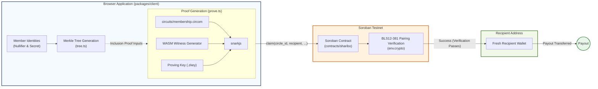

# Sharibo

[](LICENSE)
[](https://developers.stellar.org/docs/networks)
[](circuits/README.md)
[](contracts/Cargo.toml)

**Private rotating savings circles on Stellar — the ajo / tanda / susu / tontine / جمعية, with the payout anonymized by a real Groth16 zero-knowledge proof, verified on-chain.**

**ajo · esusu · tanda · cundina · susu · tontine · junta · pandero · consórcio · hui · paluwagan · chit fund · جمعية**

Five members fund a shared pot. One member claims it — by proving _"I'm a genuine, un-paid member of this circle"_ without revealing **which** member. The proof is generated in the browser and verified by a Soroban contract using Stellar's native BLS12-381 pairing host functions. No mock. No stub. No trusted server.

Built for the **Stellar Hacks: Real-World ZK** hackathon. Testnet only, no real funds.

## What is a ROSCA?

A **rotating savings and credit association** (ROSCA) is one of the oldest financial tools in the world. It works on a simple agreement:

1. **A fixed group** — friends, family, neighbors, or coworkers — agrees to contribute the same amount every round (weekly, monthly, whatever).
2. **One person takes the whole pot** each round. The group rotates until every member has had a turn.
3. **No bank, no interest, no credit score.** The group runs on social trust: if you take the pot early, you keep contributing until everyone else has had theirs.

**Why they matter:** ROSCAs serve hundreds of millions of people worldwide — from market traders to software engineers — in places where banking is expensive, inaccessible, or simply not the norm. They turn _"I trust this group more than a faceless institution"_ into working capital. A member who needs cash for inventory, school fees, or an emergency gets it without a loan application.

**Where the names come from:**

| Name                                | Region / Community                                             | Locale            | Review  |
| ----------------------------------- | -------------------------------------------------------------- | ----------------- | ------- |
| **ajo** / **esusu**                 | Nigeria, West Africa (Yoruba)                                  | yo                | machine |
| **tanda**                           | Mexico, Latin America                                          | es                | native  |
| **susu**                            | Ghana, the Caribbean                                           | en (no dedicated) | —       |
| **tontine**                         | Francophone Africa, France (origin: 17th-c. Italian _tontina_) | fr                | machine |
| **cundina**, **junta**, **pandero** | Colombia / Peru, Dominican Republic / Venezuela                | es                | native  |
| **consórcio**                       | Brazil                                                         | pt                | machine |
| **hui**                             | China, Taiwan, Chinese diaspora                                | zh                | machine |
| **paluwagan**                       | Philippines                                                    | tl                | machine |
| **chit fund**                       | India (registered, regulated variant)                          | hi                | machine |
| **جمعية** / **gam'eya**             | Arabic-speaking world                                          | ar                | machine |

`en` and `es` are the reviewed, complete locales. Other locale files may be machine-translated stubs or partials; **`ar` is the RTL proof locale** (sets `dir="rtl"` and exercises logical CSS).

**Why privacy matters:** In a traditional ROSCA, everyone knows who collected the pot this round. That transparency is fine when the group is small and offline — but put the same circle on a public blockchain and suddenly every deposit and payout is visible to _the entire world_. Sharibo's zero-knowledge proof restores the privacy boundary the original social structure assumes: the contract knows _that_ the claimant is a rightful member (via the ZK proof and the group's Merkle root), but **no observer — not even the other members — can link the payout address back to a specific member**. The circle stays on-chain; the connections stay off it.

**[🚀 live app (testnet)](https://dist-flax-three-43.vercel.app)** · **[📖 full product breakdown](full_product_breakdown.md)** · **[🛠 build log](NOTES.md)** · **[📚 glossary](docs/glossary.md)** · **[🤝 contributing](CONTRIBUTING.md)**

---

## On-chain evidence (testnet — verify any of it yourself)

Every claim below was produced by running this repo against live Stellar testnet infrastructure. Nothing is asserted from a test double.

> [!NOTE]
> **Testnet resets:** Stellar testnet is reset quarterly, which wipes all deployed contracts and transaction history.
>
> All contract IDs, schema versions, verification key hashes, and transaction evidence are tracked in the **[Deployments Table](docs/deployments.md)**.
>
> If testnet has been reset and the evidence in the table has gone stale, you can always generate fresh, zero-dependency on-chain evidence by running the end-to-end suite:
>
> ```bash
> npm run e2e
> ```
>
> This script exercises the entire 4-signal circuit and smart contract on testnet, proving that the flow works _right now_, regardless of historical resets.

## Verify it yourself in 60 seconds

No toolchain needed — just `curl`.

**1. The accepted proof is a real, successful testnet transaction:**

Grab the latest proof transaction hash from the **[Deployments Table](docs/deployments.md)** and run:

```bash
curl -s https://horizon-testnet.stellar.org/transactions/<TX_HASH> | grep -E '"successful"|"ledger"'
# → "successful": true,   "ledger": ...
```

**2. The contract is live and holds real circle state** (requires [`stellar` CLI](https://developers.stellar.org/docs/tools/cli)):

Grab the latest Contract ID from the **[Deployments Table](docs/deployments.md)** and run:

```bash
stellar contract invoke \
  --id <CONTRACT_ID> \
  --network testnet -- get_circle --circle_id 0
# → Circle { root, contribution, size: 5, round: ≥1, ... } — round ≥ 1 means a real claim has already succeeded
```

**3. Or view it in the explorer:** [contract on stellar.expert](https://stellar.expert/explorer/testnet/contract/<CONTRACT_ID>) — five deposits in, one payout out, to an address that appears nowhere else in the circle.

To reproduce everything from source (circuit build → trusted setup → tests → full e2e round), see [Run it](#run-it).

---

## Why this was hard (the 30-second version)

The standard Circom/Groth16 stack targets the **BN254** curve. On Soroban, a single pure-Rust BN254 pairing (per Stellar's own `import_ark_bn254` example) costs **~560 million CPU instructions — against a hard 100 million per-transaction cap.** Not expensive: impossible.

So Sharibo runs the entire pipeline — circuit, trusted setup, Poseidon parameters, contract, client encoding — on **BLS12-381**, the curve Stellar accelerates natively (`env.crypto().bls12_381().pairing_check(...)`). A real `claim()` with a real proof fits comfortably within the 100M budget, verified and enforced in contract unit tests. For complete measured instruction counts across operations, see [contracts/BENCHMARKS.md](contracts/BENCHMARKS.md). That required sourcing Poseidon round constants generated for the BLS12-381 scalar field (cross-checked against `soroban-sdk`'s own `BLS12_381_FR_MODULUS_BE`) and byte-exact wire formats across circuit ↔ contract ↔ client. Full story: [breakdown §6](full_product_breakdown.md#6-deep-dive-the-zk-circuit) and [§14](full_product_breakdown.md#14-key-engineering-decisions-and-deviations).

## What the ZK is doing (load-bearing, not decorative)

The claimant proves, in zero knowledge:

1. **Membership** — `Poseidon(identityNullifier, identitySecret)` is a leaf under the circle's committed Merkle root (which member: hidden).
2. **One claim per round** — a nullifier bound to `(circle_id, round)`; the contract records it, so replay fails with `AlreadyClaimed`.
3. **Unlinkability** — the pot pays out to any address the claimant chooses; in the demo, a keypair that has never touched the circle.

An on-chain observer sees five deposits and one payout — and no way to connect them.

Full structured breakdown — assets, adversaries, and which code enforces each property (and its limits) — in [docs/threat-model.md](docs/threat-model.md).

## Honest limitations

- **Claim-side privacy only.** Funding is fully public, by scope: shielded deposits are a different (harder) problem — roadmap.
- **One round demoed**, not a full multi-round rotation with on-chain turn ordering.
- **Testnet + test token**; single-party trusted setup (fine for a demo, not production). Planned multi-party runbook: [docs/ceremony.md](docs/ceremony.md) (#546) — **not executed yet**.
- **Poseidon-over-BLS12-381 constants come from a third-party package** — modulus cross-checked against Soroban's own constant and structurally reviewed (8 full + 56 partial rounds, x⁵ S-box), but not independently audited. See canonical details in [docs/poseidon-provenance.md](docs/poseidon-provenance.md).
- **Not audited.** Audit-readiness materials (repro steps, scope draft, negative-test inventory) live in [docs/audit/](docs/audit/README.md) (#547) — not an audit report.
- Nothing is silently faked; every simplification is disclosed here, in code comments, and in the historical [NOTES.md](NOTES.md) build log. Details: [breakdown §18](full_product_breakdown.md#18-honest-limitations).

## Tests

| Suite                                    | Coverage                                                                                                                                | Result  |
| ---------------------------------------- | --------------------------------------------------------------------------------------------------------------------------------------- | ------- |
| Circuit (`circuits/test/`)               | valid proof, wrong root, tampered path, nullifier determinism, non-boolean path index                                                   | passing |
| Contract (`contracts/sharibo/src/test/`) | happy path **with a real proof**, underfunded, replay, stale round tag, forged public input (real pairing failure), CPU budget, auth ×2 | passing |
| Core (`packages/core/`)                  | cryptography primitives, poseidon hashes, merkle tree logic                                                                             | passing |
| Client (`packages/client/`)              | identity generation, tree construction, proof generation, typed contract calls                                                          | passing |
| App (`app/`)                             | browser UI, identity state, funding flow, proof generation in-browser                                                                   | passing |
| Scripts (`scripts/`)                     | e2e and smoke test helpers, maintenance checkers                                                                                        | passing |
| E2E (`scripts/e2e.ts`, live testnet)     | create → 5× fund → prove → claim to fresh address → assertions → round 2 fund → replay → `AlreadyClaimed`                               | passing |

## Benchmarks

- **On-chain contract CPU limits:** [contracts/BENCHMARKS.md](contracts/BENCHMARKS.md) (run with `just bench-contract`).
- **Off-chain client proving wall-clock time:** [packages/client/BENCHMARKS.md](packages/client/BENCHMARKS.md) (run with `just bench-prove`).

## Architecture


```mermaid
flowchart LR
    %% Browser / Client Layer
    subgraph Browser ["Browser Application (packages/client)"]
        direction TB
        Identities["Member Identities<br/>(Nullifier & Secret)"]
        MerkleTree["Merkle Tree Generation<br/>(tree.ts)"]

        subgraph Proving ["Proof Generation (prove.ts)"]
            direction LR
            Circuit["circuits/membership.circom"]
            SnarkJS["snarkjs"]
            Wasm["WASM Witness Generator"]
            Zkey["Proving Key (.zkey)"]

            Circuit --> SnarkJS
            Wasm --> SnarkJS
            Zkey --> SnarkJS
        end

        Identities --> MerkleTree
        MerkleTree -.-> |Inclusion Proof Inputs| Proving
    end

    %% Network / On-chain Layer
    subgraph Network ["Soroban Testnet"]
        direction TB
        Contract["Soroban Contract<br/>(contracts/sharibo)"]
        Pairing["BLS12-381 Pairing Verification<br/>(env.crypto)"]

        Contract --> Pairing
    end

    %% Recipient Layer
    subgraph Recipient ["Recipient Address"]
        Wallet["Fresh Recipient Wallet"]
    end

    %% Data Flow Transitions
    Proving --> |"claim(circle_id, recipient, ...)"| Contract
    Pairing --> |"Success (Verification Passes)"| Wallet
    Wallet --> |Payout Transferred| Payout(("Payout"))

    style Browser fill:#f5faff,stroke:#1d3557,stroke-width:2px
    style Network fill:#fff3e0,stroke:#e65100,stroke-width:2px
    style Recipient fill:#f1f8e9,stroke:#33691e,stroke-width:2px
    style Payout fill:#e8f5e9,stroke:#2e7d32,stroke-width:2px
```

```
create_circle(admin, token, root, contribution, size, vk) -> circle_id
        │  root = Merkle root of Poseidon(identityNullifier, identitySecret)
        │  for every member, computed off-chain by the client
        ▼
fund(circle_id, from)  ×5
        │  from.require_auth(); pot += contribution
        ▼
claim(circle_id, recipient, nullifier_hash, external_nullifier, proof)
        │  1. pot == contribution * size                      ("round not funded")
        │  2. external_nullifier == SHA256(circle_id, round) mod r ("wrong round tag")
        │  3. nullifier_hash unused for (circle_id, ·)         ("already claimed")
        │  4. real Groth16 / BLS12-381 pairing check passes    ("invalid proof")
        │  → mark nullifier used, pay pot to recipient, pot=0, round+=1
```

Circuit: `circuits/membership.circom`. Contract: `contracts/sharibo/src/lib.rs`. Client SDK: `packages/client/`. E2E script: `scripts/e2e.ts`. Browser demo: `app/`.

### Invariants held across circuit / contract / client

- **BLS12-381** throughout — not the more common BN254/bn128. Stellar's Soroban host only accelerates BLS12-381 pairing operations; a pure-Rust BN254 pairing check measured ~560M CPU instructions against a 100M budget ([ADR 005](docs/adr/005-bls12-381-curve-choice.md), [contracts/BENCHMARKS.md](contracts/BENCHMARKS.md)), so BN254 verification doesn't fit at all.
- **Commitment:** `leaf = Poseidon(identityNullifier, identitySecret)`.
- **Nullifier:** `nullifierHash = Poseidon(identityNullifier, externalNullifier)` — Poseidon is used here and for the Merkle tree because it's cheap _inside the circuit's constraint system_.
- **Round tag:** `externalNullifier = SHA256(circle_id, round) mod r` — **not** Poseidon. This binding happens outside the circuit (in the contract and in the client, not inside the SNARK), where Soroban has a native accelerated SHA-256 and no native Poseidon at all, so nothing is gained by matching the circuit's hash choice there. Deliberate and permanent, not a placeholder — [docs/wire-format.md](docs/wire-format.md).
- **Public signal order:** `[nullifierHash, root, externalNullifier, recipientHash]` (circuit output first, then declared public inputs, in that order) — this is what circom/snarkjs actually emit, not the `[root, externalNullifier, nullifierHash]` a naive reading might assume. Circuit, contract, and client must agree ([docs/wire-format.md](docs/wire-format.md), [ADR 006](docs/adr/006-recipient-binding.md)).
- **Poseidon constants:** [docs/poseidon-provenance.md](docs/poseidon-provenance.md).
- **Field:** BLS12-381 scalar field throughout (client, contract, circuit).

## Run it

Fresh-machine steps, in order. Everything below targets **Stellar testnet only**.

> Setup a problem? See [docs/troubleshooting.md](docs/troubleshooting.md).

### 0. Prerequisites

| Tool                                                                       | Minimum                                                                                             | Tested                                                               |
| -------------------------------------------------------------------------- | --------------------------------------------------------------------------------------------------- | -------------------------------------------------------------------- |
| [Rust](https://rustup.rs/) + `wasm32v1-none` target                        | rustc **1.94.1** (pinned in rust-toolchain.toml)                                                    | `rustc 1.94.1`                                                       |
| [`stellar` CLI](https://developers.stellar.org/docs/tools/cli/install-cli) | **v21.0** (protocol 22 required for BLS12-381 host functions; protocol 23 for `soroban-sdk = "23"`) | `23.4.1`                                                             |
| [Node.js](https://nodejs.org/)                                             | **20.6.0** (`process.loadEnvFile`, used in `scripts/e2e.ts`)                                        | `v24.11.1`                                                           |
| [`circom`](https://docs.circom.io/getting-started/installation/) on `PATH` | **2.1.6** (pragma in `circuits/membership.template.circom`)                                         | `2.2.3` (pinned in `circuits/config.json`, asserted by `compile.sh`) |

`snarkjs` (`0.7.6`) is a devDependency in `circuits/package.json` — no separate global install required; it runs via `npx` during `npm run setup`.

Install the Rust target after installing Rust:

```bash
rustup target add wasm32v1-none
```

After installing the tools above, run the doctor to verify your setup before continuing:

```bash
just doctor
# or, without just:
npm run doctor --workspace=scripts
```

The doctor checks the tools above plus `curl`, `.env` validity, circuit test dependencies, the built client SDK, and verified circuit artifacts. It reports what was found vs. required, gives a fix command and troubleshooting link for failures, and exits non-zero only for blocking failures. Run `just doctor --fix` to apply mechanical fixes such as installing the Rust target or building the SDK. See [docs/troubleshooting.md](docs/troubleshooting.md) for the symptom→cause reference that backs each check.

### 1. Install and configure

```bash
npm install                       # installs the whole workspace (circuits, packages/client, scripts, app)
cp .env.example .env               # fill in ADMIN_SECRET_KEY / MEMBER_SECRET_KEY etc.
stellar keys generate admin --network testnet --fund
stellar keys generate member --network testnet --fund
stellar keys show admin            # paste into .env as ADMIN_SECRET_KEY / ADMIN_PUBLIC_KEY
stellar keys show member           # paste into .env as MEMBER_SECRET_KEY / MEMBER_PUBLIC_KEY
```

### 2. Build the circuit + trusted setup

```bash
cd circuits
npm run compile     # circom --prime bls12381 -> build/membership.{r1cs,sym}, build/membership_js/membership.wasm
npm run setup        # Powers-of-Tau (bls12381) + Groth16 zkey -> verification_key.json (committed)
npm run prove         # proves + verifies circuits/input.example.json locally
npm test               # circom_tester suite: valid proof, wrong root, tampered path, nullifier determinism, boolean checks
cd ..
```

### 3. Contract

```bash
cd contracts
cargo test                 # runs all tests in contracts/sharibo/src/test/
stellar contract build
stellar contract deploy --wasm target/wasm32v1-none/release/sharibo.wasm --source admin --network testnet
cd ..
# paste the returned contract id into .env as SHARIBO_CONTRACT_ID
```

A test token is needed for the pot — the simplest option on testnet is the native asset:

```bash
stellar contract id asset --asset native --network testnet
# paste into .env as TEST_TOKEN_CONTRACT_ID
```

### 4. Smoke test (read-only health check)

```bash
npm run smoke                      # checks RPC, Horizon, and circle 0
npm run smoke -- --circle-id 3     # check a specific circle
```

A fast, read-only probe that verifies your deployment is healthy: hits the Soroban RPC health endpoint, the Horizon root, and reads a circle from the contract. No transactions, no keys needed beyond `.env` contract IDs. Useful after a testnet reset, before a demo, or as a contributor's first successful command.

### 5. End-to-end script (Node, no browser)

```bash
npm run e2e                                    # full run (default)
npm run e2e -- --skip-replay                   # stop after the successful claim
npm run e2e -- --reuse-circle 0                # skip circle creation, run against existing circle 0
npm run e2e -- --verbose                       # echo each RPC/HTTP interaction
npm run e2e -- --skip-replay --verbose         # combine flags freely
```

Runs a full round against testnet for real: creates a 5-member circle, funds it from 5 fresh friendbot-funded accounts, generates a real Groth16 proof for one member, claims the pot to a **freshly generated recipient address**, asserts the payout/round-advance, then funds a second round and asserts that replaying the same proof's nullifier is rejected on-chain with `AlreadyClaimed`.

**Flags** (`node:util parseArgs`, no new deps):

| Flag                  | Effect                                                                |
| --------------------- | --------------------------------------------------------------------- |
| `--skip-replay`       | Stop after the successful claim (skip round 2 funding + replay check) |
| `--reuse-circle <id>` | Skip circle creation; run against an existing circle                  |
| `--verbose`           | Echo each RPC/HTTP interaction for debugging                          |

> This script shells out to `curl` for friendbot/Horizon calls rather than using `fetch()` — see `NOTES.md` if you're curious why. Run `npm run e2e` in the foreground when debugging hangs — see [docs/canary.md](docs/canary.md).

### 6. Browser demo

```bash
cd app
cp .env.example .env       # same contract/token ids as above, VITE_-prefixed
npm run dev                  # runs `sync-circuit` first (copies circuits/build/* into app/public/circuits/)
```

Open the printed localhost URL. The whole flow (identities, funding, proving, claiming) runs against real testnet from a single browser tab.

## Changing the Merkle tree depth

The Merkle tree depth (`levels`) is single-sourced in [`circuits/config.json`](circuits/config.json) — a 4-level tree fits up to 16 members, a 5-member circle fits depth 3, a 100-member circle needs depth 7, etc. Everything that needs the depth (the circuit, the circuit tests, and the client SDK's `TREE_LEVELS`) reads it from that one file; `circuits/membership.circom` itself is a **generated** file (see `circuits/scripts/gen-circuit.cjs`) and is gitignored — the committed source is `circuits/membership.template.circom`.

To change the depth:

1. Edit `circuits/config.json` (`{"levels": N}`).
2. Recompile: `cd circuits && npm run compile` (this regenerates `membership.circom` from the template + new config, then runs `circom`).
3. **Re-run the trusted setup** — this is not optional. A different `levels` value changes the circuit's constraint system, which means a **new zkey and verification key**: `npm run setup`. The old `verification_key.json` no longer matches the circuit and must be regenerated/recommitted.
4. Sanity-check: `npm test` (circuit test suite) and `npm run prove` (proves + verifies `circuits/input.example.json` — note: `input.example.json`'s `pathElements`/`pathIndices` arrays must also be regenerated for the new depth).
5. **Redeploy affected circles with the new verification key.** Any circle created against the old vkey needs a fresh contract deployment (or an admin vkey-rotation path if the contract supports one) — proofs generated against the old tree depth will not verify against the new vkey, and vice versa. There is no in-place migration for open circles across a depth change.
6. If the browser app is deployed, re-run `npm run sync-circuit` (in `app/`) to pick up the new `membership.wasm` / `membership_final.zkey` / `verification_key.json`.

## Repository structure

```
sharibo/
├── app/                 React + Vite browser demo
├── circuits/            membership.template.circom (source) + config.json, compile/setup/prove scripts, circuit tests, verification_key.json
├── contracts/sharibo/   the Soroban contract (lib.rs) + its test suite (test.rs)
├── docs/                long-form docs, ADRs, and docs/hackathon/ (point-in-time archive)
├── judges/              historic hackathon entry point
├── packages/client/     isomorphic TS SDK: identity.ts, tree.ts, prove.ts, contract.ts, config.ts
├── packages/core/       shared crypto primitives (Poseidon, Merkle, identity)
├── scripts/             e2e/smoke helpers
├── scripts/maintenance/ checkers (secrets, SDK pin, clean)
├── test-vectors/        cross-implementation Poseidon fixtures shared by the client and circuit test suites
├── __mocks__/           vitest mock files for app tests
├── README.md            this file
├── NOTES.md             historical append-only build log (not the authority for current invariants)
├── full_product_breakdown.md  every facet of the system, in detail
├── docs/hackathon/hackathon_demo_script.md   demo video script (motion + voiceover)
├── justfile             command runner configurations
└── knip.jsonc           dependency and dead code linting configuration
```

Full annotated version (what each file does and why): [breakdown §16](full_product_breakdown.md#16-repository-structure). See also [docs/index.md](docs/index.md) for a complete documentation index and the contributor-friendly [architecture guide](docs/architecture.md).

## Contributing

We welcome contributions to Sharibo! See [CONTRIBUTING.md](CONTRIBUTING.md) for the development workflow, how to run the test suites, and the dependency audit runbook. Please ensure you have read and adhere to our [Code of Conduct](CODE_OF_CONDUCT.md) when participating in this project. If terms like _Groth16_ or _Merkle root_ are new to you, start with the [glossary](docs/glossary.md).

`@stellar/stellar-sdk` is declared independently in `app`, `packages/client`, and `scripts`, and pinned to a single resolved version via a root `overrides` entry. **Bump `stellar-sdk` in all three places at once** — `npm run check:stellar-sdk` (also run automatically on `npm install`) fails the build if the declared ranges ever drift apart.

## Roadmap

There is a detailed mainnet readiness checklist covering audits, trusted setups, and remaining blockers: see [**`docs/mainnet-readiness.md`**](docs/mainnet-readiness.md).

- Funding-side shielding (hide _who_ funded, not just who claimed).
- Multi-round automation / on-chain turn ordering.
- Multi-party trusted setup ceremony.
- Independent audit of the BLS12-381 Poseidon parameters (or a switch to self-generated / better-provenanced constants).
- Real stablecoin (issued test asset or mainnet equivalent) instead of native testnet XLM.
- **Selective disclosure ("view key")** — an admin/auditor could prove a circle's _total_ historical contributions (a sum over funding events already visible on-chain) without exposing which individual funded which round. Not built; the shape is in [breakdown §19](full_product_breakdown.md#19-roadmap).

## Handsoff notes

<!-- handsoff-issue-501 -->

- #501: App.tsx dynamically imports `@sharibo/client` in four handlers while also importing it statically — no split, just noise
